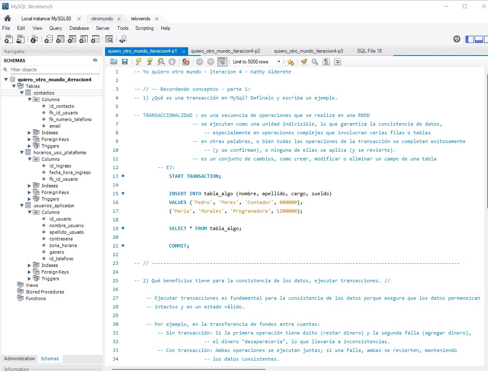

**_<h1 align="center">:vulcan_salute: Ejercicio Individual Número 4 :computer:</h1>_**
**_<h2 align="center">Módulo 3 - Fundamentos de Bases de Datos Relacionales</h2>_**

- Creación de tablas
- Creación e incoporación de llaves primerias y foraneas
- Alteración para incorporar más llaves foráneas
- Deficiniciones asociadas a transaccionalidad

